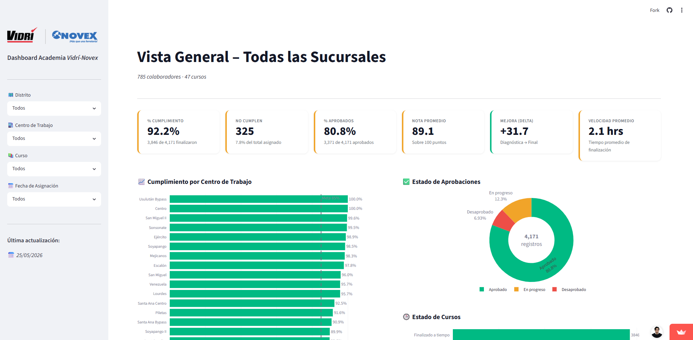

#  Learning Analytics Dashboard

**Learning Analytics Dashboard** es un dashboard interactivo desarrollado con Streamlit para monitorear y analizar el desempeño de los colaboradores dentro de una plataforma de aprendizaje corporativo (e-learning).

La aplicación centraliza la información de capacitación y proporciona indicadores clave, visualizaciones dinámicas y análisis que permiten evaluar el progreso de los colaboradores, el cumplimiento de cursos y la efectividad de los programas de formación.

Este proyecto forma parte de mi portafolio de Analítica de Datos y tiene como objetivo demostrar habilidades en transformación de datos, desarrollo de KPIs, visualización de información y construcción de soluciones orientadas al negocio utilizando Python.

## Tabla de Contenidos

- [ Learning Analytics Dashboard](#-learning-analytics-dashboard)
  - [Tabla de Contenidos](#tabla-de-contenidos)
  - [🎯 Problema de Negocio](#-problema-de-negocio)
  - [💡 Solución](#-solución)
  - [📊 Funcionalidades Principales](#-funcionalidades-principales)
    - [📌 Resumen Ejecutivo](#-resumen-ejecutivo)
    - [📚 Análisis de Cursos](#-análisis-de-cursos)
    - [👥 Análisis de Colaboradores](#-análisis-de-colaboradores)
    - [🔍 Filtros Interactivos](#-filtros-interactivos)
  - [📈 KPIs Monitoreados](#-kpis-monitoreados)
  - [🛠️ Tecnologías Utilizadas](#️-tecnologías-utilizadas)
    - [Lenguaje de Programación](#lenguaje-de-programación)
    - [Análisis de Datos](#análisis-de-datos)
    - [Visualización de Datos](#visualización-de-datos)
    - [Fuente de Datos](#fuente-de-datos)
    - [Herramientas de Desarrollo](#herramientas-de-desarrollo)
  - [📂 Estructura del Proyecto](#-estructura-del-proyecto)
  - [🔄 Flujo de Datos](#-flujo-de-datos)
  - [📷 Vista Previa del Dashboard](#-vista-previa-del-dashboard)
    - [Vista para el equipo gerencial](#vista-para-el-equipo-gerencial)
  - [🌐 Aplicación en Producción](#-aplicación-en-producción)
  - [⚙️ Instalación](#️-instalación)
    - [Clonar el repositorio](#clonar-el-repositorio)
    - [Ingresar al directorio del proyecto](#ingresar-al-directorio-del-proyecto)
    - [Instalar dependencias](#instalar-dependencias)
    - [Ejecutar la aplicación](#ejecutar-la-aplicación)
  - [📌 Impacto de Negocio](#-impacto-de-negocio)
  - [🎓 Habilidades Demostradas](#-habilidades-demostradas)
  - [🚀 Posibles Mejoras Futuras](#-posibles-mejoras-futuras)
  - [👨‍💻 Autor](#-autor)
  - [📄 Licencia](#-licencia)

## 🎯 Problema de Negocio

En muchas organizaciones, los programas de capacitación generan grandes volúmenes de información que suelen almacenarse en hojas de cálculo o exportaciones de plataformas LMS. Compartir estos resultados a los líderes para que den seguimiento puede resultar engorroso si solo les compartimos hojas de cálculo sin contexto.

Sin una solución analítica adecuada, resulta difícil:

- Monitorear el cumplimiento de capacitaciones.
- Identificar cursos pendientes o vencidos.
- Medir la participación de los colaboradores.
- Evaluar el desempeño de los programas de formación.
- Detectar oportunidades de mejora en los procesos de aprendizaje.
- Generar reportes ejecutivos de manera rápida y eficiente.

## 💡 Solución

Learning Analytics Dashboard transforma datos operativos en información estratégica mediante un dashboard interactivo que permite:

- Monitorear el avance de los colaboradores.
- Analizar indicadores clave de capacitación.
- Evaluar el cumplimiento de cursos.
- Identificar tendencias de participación.
- Visualizar métricas de aprendizaje en tiempo real.
- Facilitar la toma de decisiones a los líderes basada en datos.

## 📊 Funcionalidades Principales

### 📌 Resumen Ejecutivo

- Indicadores generales de capacitación.
- KPIs de desempeño.
- Estado general de los cursos.
- Métricas de participación.

### 📚 Análisis de Cursos

- Cursos más asignados.
- Cursos más completados.
- Tasas de finalización.
- Distribución de capacitaciones.

### 👥 Análisis de Colaboradores

- Seguimiento individual.
- Cumplimiento de capacitaciones.
- Participación por colaborador.
- Ranking de desempeño.

### 🔍 Filtros Interactivos

- Filtrado por centro de trabajo.
- Filtrado por distrito.
- Filtrado por curso.
- Filtrado por fecha de asignación.
- Actualización dinámica de indicadores y visualizaciones.

## 📈 KPIs Monitoreados

El dashboard incluye métricas clave para la gestión de capacitación:

- Total de colaboradores.
- Total de cursos asignados.
- Total de cursos completados.
- Tasa de finalización.
- Tasa de aprobación.
- Cursos pendientes.
- Nota promedio de evaluaciones.
- Tiempo promedio de finalización.
- Participación de colaboradores.
- Comparación entre evaluación diagnóstica y final (delta).
- Indicadores de engagement.

## 🛠️ Tecnologías Utilizadas

### Lenguaje de Programación

- Python

### Análisis de Datos

- Pandas
- NumPy

### Visualización de Datos

- Plotly
- Streamlit

### Fuente de Datos

- Microsoft Excel

### Herramientas de Desarrollo

- Git
- GitHub

## 📂 Estructura del Proyecto

```text
learntrack-analytics/
│
├── data/
├── docs/
├── img/
├── .gitignore
├── app.py
├── requirements.txt
├── README.md
└── LICENSE
```

## 🔄 Flujo de Datos

```text
Archivo Excel
      │
      ▼
Extracción de Datos
      │
      ▼
Limpieza y Transformación
      │
      ▼
Cálculo de KPIs
      │
      ▼
Visualizaciones
      │
      ▼
Dashboard en Streamlit
```

---

## 📷 Vista Previa del Dashboard

### Vista para el equipo gerencial



## 🌐 Aplicación en Producción

Puedes acceder al dashboard desplegado desde el este **[enlace](https://learning-analytics-dashboard.streamlit.app/)**.

## ⚙️ Instalación

### Clonar el repositorio

```bash
git clone https://github.com/ayorick23/learning-analytics-dashboard.git
```

### Ingresar al directorio del proyecto

```bash
cd learning-analytics-dashboard
```

### Instalar dependencias

```bash
pip install -r requirements.txt
```

### Ejecutar la aplicación

```bash
streamlit run app.py
```

## 📌 Impacto de Negocio

Este dashboard permite a los equipos de Recursos Humanos y Líderes de Sucursales:

- Reducir el tiempo invertido en reportes manuales.
- Monitorear el cumplimiento de capacitaciones en tiempo real.
- Identificar colaboradores con capacitaciones pendientes.
- Evaluar la efectividad de los programas de formación.
- Mejorar la toma de decisiones mediante indicadores confiables.

## 🎓 Habilidades Demostradas

A través de este proyecto se aplicaron conocimientos de:

- Limpieza y transformación de datos.
- Desarrollo de KPIs.
- Análisis exploratorio de datos (EDA).
- Visualización de información.
- Business Intelligence.
- People Analytics.
- Learning Analytics.
- Desarrollo de aplicaciones con Streamlit.
- Control de versiones con Git y GitHub.

## 🚀 Posibles Mejoras Futuras

- [ ] Integración con bases de datos SQL.
- [ ] Actualización automática de datos.
- [ ] Automatización mediante pipelines ETL.
- [ ] Modelos predictivos de finalización de cursos.
- [ ] Segmentación de colaboradores.
- [ ] Sistema de autenticación de usuarios.
- [ ] Implementación de recomendaciones de aprendizaje.

## 👨‍💻 Autor

**Dereck Méndez**

Analítica de Datos | Business Intelligence | Python | Learning & Development

- **GitHub:** https://github.com/ayorick23
- **LinkedIn:** https://linkedin.com/in/dereckmendez

## 📄 Licencia

Este proyecto se distribuye bajo la licencia MIT.
